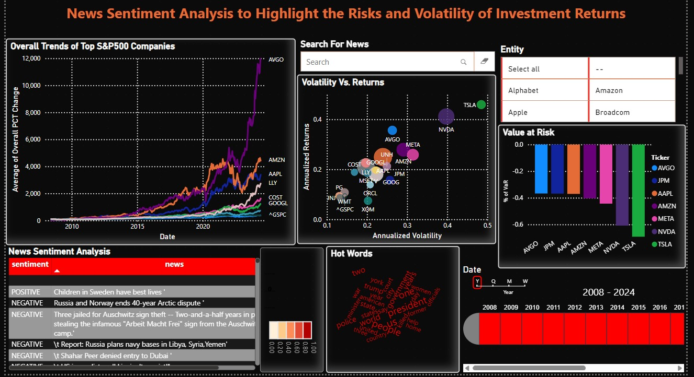
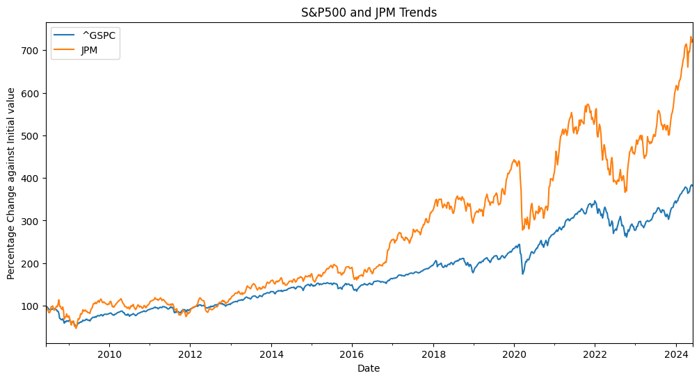
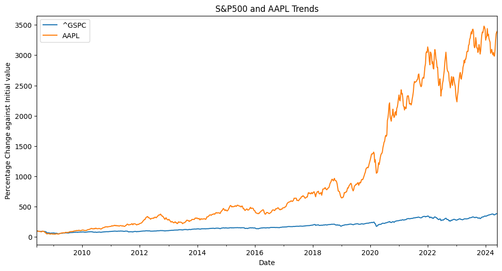
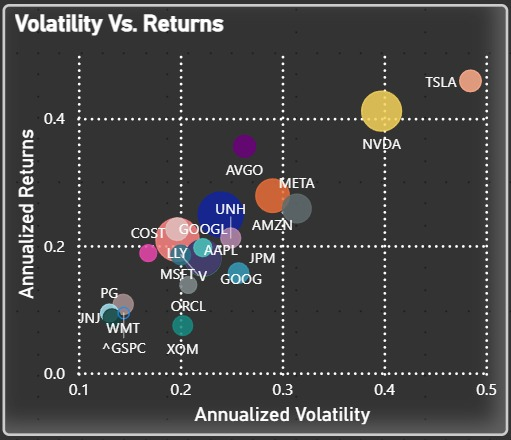
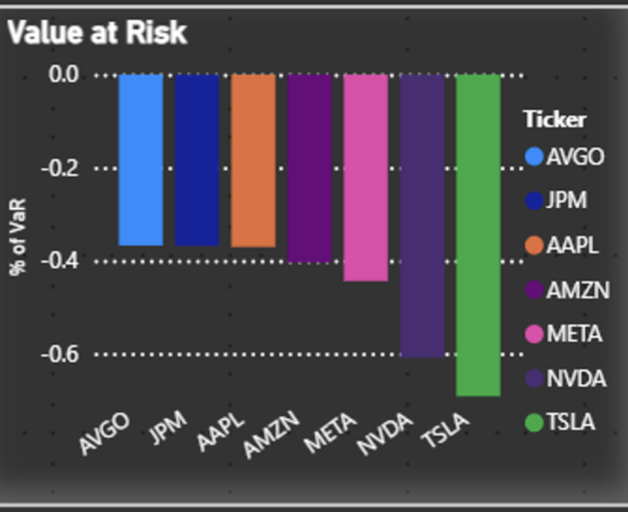
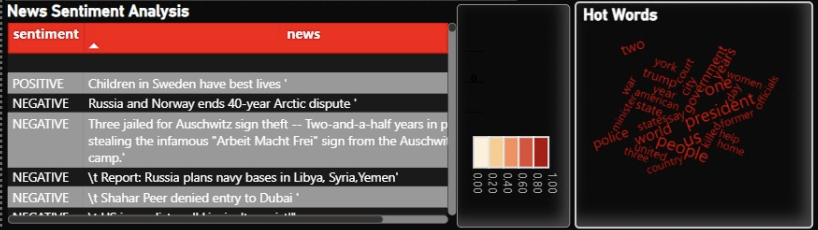
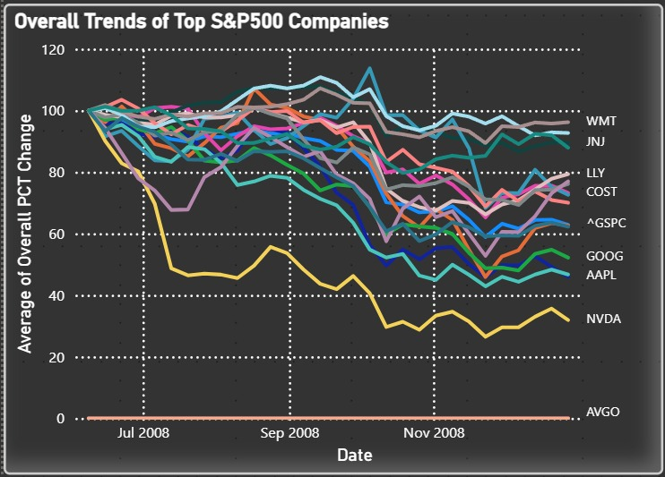

# 💼 Black Guard: Work with Money, not Work for Money

A multi-dashboard analytics project to help Black Guard — an investment advisory firm — attract **young professionals** by showcasing the benefits and risks of **early long-term investing**. This project applies real financial data, global statistics, and news sentiment analysis to derive **strategic marketing insights** and guide investment behavior.

> Developed as a group project under Data Preparation & Visualisation module at Nanyang Polytechnic

---

## 📌 Project Objectives

* Segment global audiences by income, profession, and HDI to identify prime investment targets
* Compare long-term wealth outcomes from **investing** vs **salary-saving**
* Use **S\&P 500 trends** to detect high-growth sectors
* Analyze **news sentiment and financial risk** using real headlines and stock data

---

## 🧭 Tools Used

* Python (Pandas, NumPy, Scikit-learn, Statsmodels, NLTK, SpaCy, Hugging Face)
* Power BI (for all dashboards)
* Yahoo Finance, BBC, NYT, Reddit World News
* CRISP-DM Methodology followed end-to-end

---

## 🧩 Dashboard Overview

### 📊 Dashboard 1: Demographic & Market Segmentation

* World map & bar charts highlight countries with high HDI, GNI, and disposable income
* Visualized potential by profession, age group, and region

### 📈 Dashboard 2: Investment Trends (S\&P 500)

* Plots adjusted close prices of major companies
* Highlights consistent industry winners over the last 20 years

### 💸 Dashboard 3: Wealth Simulation

* Compares saving-only vs. long-term investing strategies
* Clear gap shown when investing early with compound returns

### 🧠 Dashboard 4: News Sentiment & Risk Analysis (Built by Min)

* Designed the entire **data mining pipeline and dashboard**
* Curated & processed financial news from **BBC, NYT, Reddit**
* Merged news events with **S\&P 500 volatility, returns, and VaR** metrics

---

## CRISP-DM Methodology Walkthrough for News Sentiment & Risk Analysis

### 🧭 1. Business Understanding

#### Objective

To help Black Guard's clients — especially young professionals — understand how news sentiment and market volatility correlate with risk in investment returns.

#### Goal

Build a decision-support dashboard that answers:

* How volatile are top-performing stocks?
* Do news breakouts significantly correlate with market movements?
* What are the real risks (e.g., Value-at-Risk) of popular companies?

---

### 🧹 2. Data Understanding

#### 📦 Datasets Used

* **Yahoo Finance**: Real-time adjusted close prices for top 20 S\&P 500 companies
* **BBC & NYT**: Historical global news headlines for major political/economic events from 2008 to 2024
* **Reddit World News**: Public sentiment insights from user discussions

#### Justification

* S\&P500 used as a market benchmark due to its proven stable annual returns
* Adjusted close price accounts for splits/dividends
* Combining retail and authoritative news enhances signal detection

---

### 🧼 3. Data Preparation

* Filtered top 20 companies by S\&P500 growth
* Calculated daily returns, annualized volatility & returns
* Mapped adjusted close prices to normalized trendlines (base = 100 in 2008)
* Cleaned news data (stopwords, punctuation, case normalization)
* Tokenized headlines and computed sentiment polarity (positive, neutral, negative)
* Linked sentiment scores to 1-week stock intervals for alignment

---

### 📊 4. Modeling & Analysis

#### Statistical Correlation Analysis

* Conducted correlation matrix on adjusted close prices across top S&P500 companies
* Applied cointegration tests to evaluate if price series move together over time (long-run equilibrium)
* Detected strong correlation clusters (e.g., tech stocks like AAPL, MSFT, AMZN)
* Used this to justify grouping in volatility-return comparisons and later VaR assessment
* Helped distinguish between random walk behavior vs statistically coupled movement
* Initial analysis checked Pearson correlation between stock volatility, returns, and sentiment polarity
* Found low numerical correlation between sentiment scores and price changes — but visual analysis later showed strong event-based impacts
* Helped justify shift from pure correlation to visual/event-linked exploration

#### Volatility vs Return Scatter Plot

* X-axis: Annualized Volatility
* Y-axis: Annualized Returns
* Bubble size: Market Cap
* Example Insight: TSLA shows highest return *AND* highest volatility → high risk-reward profile

#### Value at Risk (5%) Bar Chart

* Interprets worst-case 5% loss scenarios
* Example: TSLA could lose >60% of value under VaR model
* Contrasts perceived safety of "popular" stocks

#### News Sentiment Trendline Integration

* Sentiment scores calculated using VADER Sentiment Analyzer (NLTK) from Hugging Face
* Classified headlines into positive, neutral, or negative categories
* VADER chosen due to its effectiveness with short-form, social-style text (e.g., headlines, Reddit posts)
* Applied to cleaned, tokenized headlines from BBC, NYT, and Reddit datasets
* Merged S&P trends with news sentiment timelines
* Interactive table: clickable news events + dynamic stock response
* Word cloud: summarization of news periods
* Heatmap: stacked sentiment view (positive-neutral-negative)
* Clear dips observed around global events (e.g., 2008 recession)

---

### 5. Evaluation

* Strong correlation seen during key events (e.g. COVID-19, 2008 crisis, political shifts)
* S\&P 500 continues to perform well on average regardless of individual company performance
* Interactive filtering validated value to end-user: scenario exploration, informed awareness
* Power BI used to support visual deployment, filter control, and user-driven exploration

---

### 🚀 6. Deployment & Recommendations

* Deployed in **Dashboard #4** of Black Guard’s Investment App
* Ready for use in client meetings or investor education
* Recommends embedding sentiment tracking into investment dashboards
* Suggests integrating real-time news feeds and VaR simulation for decision support

This notebook exemplifies the importance of blending qualitative signals (news) with quantitative metrics (returns, VaR) to make smarter, emotionally-aware investment decisions.

---

#### 💬 Insights

* Risk ≠ reward — some of the best-performing stocks carry heavy downside risk
* News sentiment (especially from Reddit or NYT) can preempt volatility shifts
* Users are empowered to **analyze, not just consume**, investment risk factors

---

## ⚙️ Challenges

* Had to understand and explain complex financial terms visually (e.g., VaR, annualized volatility)
* Managed a diverse dataset merging structured stock data with unstructured news
* Led the team’s **data preparation pipeline**, ensuring consistency across dashboards

---

## 🎓 Outcome

* Delivered a complete interactive toolset for Black Guard to target **young professionals** with personalized investment scenarios
* Promoted financial literacy by demystifying volatility and long-term returns
* Used real data to create persuasive storytelling and evidence-backed risk awareness

---

## 💎 Authors & Credits

\[Year 2, Data Preparation & Visualisation Project, Diploma in AI & Data Engineering, Nanyang Polytechnic]\

* **[Min Phyo Thura](https://github.com/myriosMin)**
* [Alexander Chan](https://github.com/Redbeanchan)
* [Mohammad Habib](https://github.com/habibmohammad35)
* Louis

---

Thanks for exploring our project. Feel free to explore our dashboards and replicate our workflow for your own financial insights. 📊📈